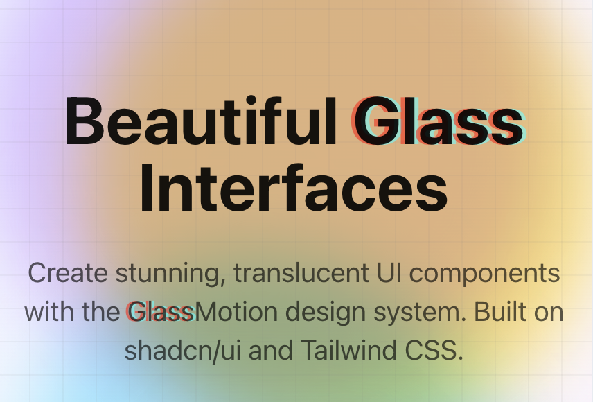

# GlassMotion

A visual and interaction design system based on **translucent surfaces, dynamic lighting, and fluid motion** — creating interfaces that feel layered, responsive, and adaptive.



🌐 **Live Demo**: [glassmotion.llmer.com](https://glassmotion.llmer.com)

## Features

- 🎨 **Translucent Surfaces** — Layered glass effects with adaptive blur and backdrop filters
- 💡 **Dynamic Lighting** — Components respond to simulated lighting with top-edge highlights
- 🎭 **Fluid Motion** — Physics-based animations with custom easing curves
- 🎯 **Adaptive Contrast** — Text automatically adjusts for WCAG AA contrast ratios
- 🧩 **Modular Components** — Built on shadcn/ui primitives with glass effects layered on top
- 🎨 **Effect System** — Composable masks, overlays, and optic effects
- ♿ **Accessible** — Reduced motion support, high contrast mode, keyboard navigation

## Tech Stack

- **Next.js 15** — React framework with App Router
- **TypeScript** — Type-safe development
- **Tailwind CSS** — Utility-first styling
- **shadcn/ui** — Base component library
- **Radix UI** — Accessible primitives
- **pnpm** — Fast, efficient package manager

## Getting Started

### Prerequisites

- Node.js 18+
- pnpm (recommended)

### Installation

```bash
# Clone the repository
git clone https://github.com/llmer/glassmotion.git
cd glassmotion

# Install dependencies
pnpm install

# Run the development server
pnpm dev
```

Open [http://localhost:3000](http://localhost:3000) to view the project.

### Build for Production

```bash
pnpm build
pnpm start
```

## Project Structure

```
src/
├── app/                          # Next.js app directory
│   ├── components/              # Component showcase page
│   ├── dashboard/               # Dashboard demo
│   ├── forms/                   # Forms demo
│   ├── effects/                 # Effects demo
│   └── layout.tsx               # Root layout with metadata
├── components/
│   ├── sections/                # Page sections (Hero, Features)
│   ├── showcase/                # Showcase components
│   │   ├── pricing-cards.tsx
│   │   ├── payment-form.tsx
│   │   ├── two-factor-auth.tsx
│   │   ├── team-invite.tsx
│   │   ├── file-upload.tsx
│   │   └── loading-showcase.tsx
│   └── layout/                  # Layout components (Navbar, Footer)
├── design-system/
│   ├── components/
│   │   └── ui/                  # Glass components
│   │       ├── GlassCard.tsx
│   │       ├── GlassButton.tsx
│   │       ├── GlassInput.tsx
│   │       └── ChromaticText.tsx
│   ├── effects/                 # Effect system
│   │   ├── GlassEffects.tsx    # Main effects component
│   │   ├── masks/              # Mask patterns
│   │   ├── overlays/           # Overlay effects
│   │   └── optics/             # Optic filters
│   └── styles/
│       └── glass-motion.css    # Glass utility classes
└── globals.css                  # CSS variables and theme
```

## Design Philosophy

GlassMotion is built on five core principles:

1. **Depth through Transparency** — Surfaces convey spatial hierarchy through blur, translucency, and shadow layering
2. **Dynamic Light Interaction** — Components respond to simulated lighting and environmental tone
3. **Motion as Context** — Transitions guide attention and reinforce spatial relationships
4. **Adaptive Contrast** — Text and controls adjust dynamically for maximum legibility
5. **Responsive Materiality** — Components adapt based on context (content density, input mode, background complexity)

See [CLAUDE.md](./CLAUDE.md) for the complete design system documentation.

## Usage

### Basic Glass Card

```tsx
import { GlassCard, CardHeader, CardTitle, CardContent } from '@/design-system/components'

export function MyCard() {
  return (
    <GlassCard elevation={2} hoverable animateIn>
      <CardHeader>
        <CardTitle>Card Title</CardTitle>
      </CardHeader>
      <CardContent>
        Card content here
      </CardContent>
    </GlassCard>
  )
}
```

### Glass Effects

```tsx
import { GlassCard } from '@/design-system/components'

export function EffectCard() {
  return (
    <GlassCard
      elevation={3}
      mask="lines"           // Diagonal line etching
      overlay="frosted"      // Frosted glass texture
      optic="chromatic-subtle" // Subtle chromatic aberration
    >
      Content with effects
    </GlassCard>
  )
}
```

### Chromatic Text

```tsx
import { ChromaticText } from '@/design-system/components'

export function Logo() {
  return (
    <h1>
      <ChromaticText preset="logo">Glass</ChromaticText>Motion
    </h1>
  )
}
```

## Available Components

- **GlassCard** — Content containers with glass effects and composable effect layers
- **GlassButton** — Interactive buttons with glass surface and hover lift
- **GlassInput** — Input fields with glass styling
- **GlassTextarea** — Textarea with glass styling
- **GlassNavBar** — Navigation bar with translucent background
- **GlassBadge** — Badge component with glass effects
- **ChromaticText** — Text with chromatic aberration effect

## Effect System

### Masks
- `subtle` — Radial gradient mask
- `lines` — Diagonal line etching (45° angle)
- `dots` — Repeating dot pattern
- `grid` — Grid pattern
- `vignette` — Radial vignette

### Overlays
- `frosted` — Frosted glass texture
- `vignette` — Dark vignette edges
- `spotlight` — Spotlight effect
- `gradient-fade` — Top gradient fade
- `color-tint` — Purple tint overlay

### Optics
- `chromatic-subtle` — 6px chromatic aberration
- `chromatic-strong` — 12px chromatic aberration
- `color-warm` — Warm color shift
- `color-cool` — Cool color shift
- `rainbow` — Rainbow effect
- `duotone-purple` — Purple duotone

## Development

This project uses **pnpm** as the package manager:

```bash
pnpm install          # Install dependencies
pnpm dev             # Start dev server
pnpm build           # Build for production
pnpm add [package]   # Add new dependency
```

### Adding shadcn Components

```bash
npx shadcn@latest add [component-name]
```

## Contributing

Contributions are welcome! Please feel free to submit a Pull Request.

## License

MIT

## Credits

Built with:
- [Next.js](https://nextjs.org/)
- [shadcn/ui](https://ui.shadcn.com/)
- [Tailwind CSS](https://tailwindcss.com/)
- [Radix UI](https://www.radix-ui.com/)

---

**Made with ❤️ by the GlassMotion team**
